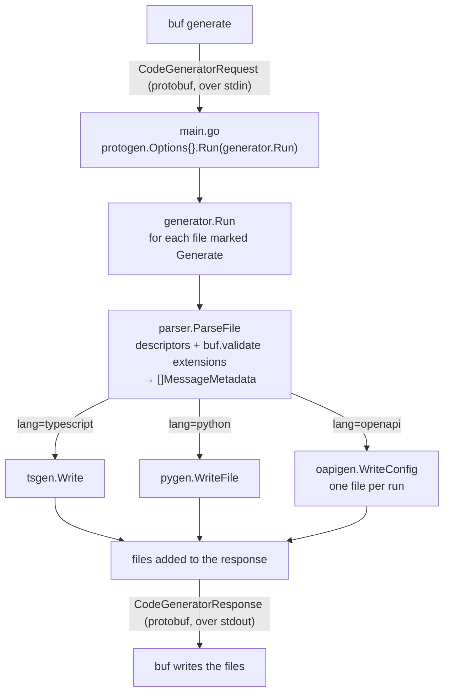

# Internals

How the plugin works. For usage, see the [README](../README.md).

## The pipeline



The plugin never touches the filesystem. `buf` hands it a serialized request on
stdin and writes whatever comes back on stdout. That is why `go run .` appears
to hang: it is waiting for a request that never arrives. Use `make generate`.

It also never sees the official generators. protoc-gen-es and protoc-gen-python
run as separate plugins in the same `buf generate` invocation, each getting its
own copy of the same request. The only coupling is a file naming convention:
`user.proto` becomes `user_pb.ts` and `user_pb2.py`, so the overlay knows what
to import without being told.

That convention is also why `lang` exists. An overlay only resolves if it sits in
the same tree as the output it imports from, and buf gives each plugin entry a
single `out`, so splitting TypeScript and Python into separate trees means
running this plugin twice, once per language.

## The three packages

| Package | Job |
|---|---|
| `main` | Entrypoint. Declares proto3-optional support, delegates to `generator.Run`. |
| `internal/parser` | Reads descriptors, extracts `buf.validate` rules, translates message CEL, produces the IR. |
| `internal/generator` | Parses the files marked for generation, then hands them to one emitter per target. |

One package per target, so a target's decisions cannot leak into another:

| Package | Job |
|---|---|
| `generator` | `run.go` parses and dispatches; `options.go` holds `lang`, which picks the targets |
| `generator/emit` | What every emitter shares and none owns: rule comments, rule lookup, identifier casing |
| `generator/tsgen` | The TypeScript overlay |
| `generator/pygen` | The Python overlay: the `Annotated` aliases |
| `generator/oapigen` | `openapi_config.yaml`, the protoc-gen-openapiv2 field options |

Inside `generator/tsgen`:

| File | Job |
|---|---|
| `context.go` | One resolution pass over every message: which narrow, which reach one, which need a retyped schema |
| `celtree.go` | The CEL terms of a message, folded into a tree keyed by field |
| `narrowing.go` | What one field's rules contribute to its message's strict type |
| `message.go` | `<Message>Strict`, and the entrypoint that writes one file |
| `file.go` | The import bookkeeping and the local-name table for one file |
| `schema.go` | `<Message>StrictSchema` and `<Service>Strict` |
| `runtime.go` | The shared `strict/types.ts` module, emitted once |
| `names.go` | The identifiers protoc-gen-es declares |

The boundary between parser and generator is deliberate. The parser knows protobuf and
protovalidate; each generator knows one target and none of them knows the others.
A generator that reached for a descriptor would have to learn the whole
extension protocol, and the next target would learn it again.

## The intermediate representation

`parser.MessageMetadata` is the only thing that crosses the boundary:

```go
type MessageMetadata struct {
    Name     string            // fully qualified, e.g. "example.v1.User"
    Fields   []FieldMetadata
    Oneofs   []OneofMetadata
    CEL      []CELRule         // message-level, spans several fields
    Comments string
}

type FieldMetadata struct {
    Name       string  // proto name:  "user_id"
    ProtoType  string  // "string", "message:example.v1.Address", "enum:...", "map<string, int32>"
    Type       TypeRef // where that message or enum is declared
    Repeated   bool
    IsMap      bool
    MapKey     string  // key type, set only when IsMap
    MapValue   string  // value type, set only when IsMap
    MapValType TypeRef // Type, but for MapValue
    Optional   bool    // explicit proto3 `optional`
    Required   bool    // (buf.validate.field).required
    OneofName  string
    Rules      []Rule  // {Kind: "string.min_len", Value: "3"}
    CEL        []CELRule
}

type TypeRef struct {
    File string // "shop/common/v1/common.proto"
    Name string // "Money", or "Warehouse.Address" for a nested type
}
```

Everything is a string or a bool. No descriptor, `protoreflect` value or CEL
type leaks through, so a generator only ever pattern-matches on text.

`ProtoType` carries its kind as a prefix (`message:`, `enum:`, `map<`) so a
generator can tell a message reference from a scalar without a type registry.

`TypeRef` exists for one consumer: the Python generator, which has to write an
import for every message and enum a field mentions. It holds the name relative
to the declaring file's package, because that is the only form that survives the
trip. The fully qualified name alone does not say where the package ends and the
nesting begins.

There is no enum metadata. protoc-gen-es and protoc-gen-python already emit the
enum types; the overlay only ever refers to them.

A message-level `CELRule` carries two more fields, filled in by `celtype.go`:

```go
type CELTerm struct {
    Path   []string // resolved from the message root: ["product", "id"]
    Kind   TermKind // empty | nonEmpty | absent | present | zero
    Source string   // the conjunct unparsed back to CEL, for when it cannot be placed
}
```

`Terms` holds the conjuncts a type can carry, `Skipped` the source of the ones it
cannot, unparsed back to CEL so the generated doc can name them. Resolution needs
descriptors, so it happens here rather than in a generator. What crosses the
boundary is still only strings.

## Reading standard rules reflectively

protovalidate defines a rule message per proto type: `StringRules`,
`Int32Rules`, `RepeatedRules`, and so on. The obvious implementation is a switch
over all of them. `parser.standardRules` instead walks the rule message with
`protoreflect`, in `collect` (`internal/parser/rules.go`): it recurses into every
singular message field carrying a dotted prefix, and records every other set
field as a `Rule`. `cel` and `cel_expression` are skipped there; they are handled
separately, with the parsed AST.

`Range` visits only the fields that are actually set, so the recursion flattens
whatever the user wrote into dotted names: `string.min_len`,
`repeated.min_items`, `repeated.items.string.uuid`.

The payoff is that **new protovalidate rules need no code here**. Bump the
dependency and they appear. The cost is that the parser cannot validate rule
names; it reports whatever it finds.

`Range` iterates in unspecified order, so the result is sorted by `Kind` before
it leaves the function. Codegen output has to be byte-identical across runs.

## Parsing CEL

Custom rules carry a CEL expression as a string. `parseCEL`
(`internal/parser/cel.go`) parses it and walks the AST with
`celast.PostOrderVisit`, recording every ident, every select's field name and
every call's function name.

That is where the `refs:` and `calls:` lines in the generated comments come
from. `this.startsWith('usr_')` reports `refs: this` and `calls: startsWith`;
operators appear in their CEL function form, so `this >= 0` reports `calls: _>=_`.

Two decisions:

- **A syntax error is data, not an error.** It lands in `CELRule.ParseError` and
  the generators render `cel[...] UNPARSEABLE: <reason>`. Expressions come from
  users, and one typo should not stop the other fifty rules in the file from
  being emitted.
- **The environment is built once**, via `sync.OnceValues`. It declares `this`
  as `cel.DynType`. Parsing needs no declarations at all; the declaration is
  there so the same environment can type-check expressions later.

## Nil is the normal case

Reading an extension off a descriptor has several legitimately-nil steps: a
field may carry no options, the options may be of an unexpected type if the
descriptor came from a foreign registry, and the extension may just be absent.

`fieldRules` (`internal/parser/parse.go`) returns nil at each of those steps,
and what it does return may be nil too.

Most fields in a real schema have no rules. Nil is the common path, not a
failure, and every consumer handles it: protobuf getters return zero values on a
nil receiver, so `rules.GetCel()` on nil is fine.

## Two descriptor quirks

**Synthetic oneofs.** proto3 `optional` is implemented as a one-field `oneof`.
It carries no user intent, so `parseMessage` skips any oneof where
`IsSynthetic()` is true. The `optional` keyword is reported through
`FieldMetadata.Optional` instead.

**Map entry messages.** A `map<K, V>` field generates a hidden nested message
holding the key/value pair. `ParseFile` skips any message where `IsMapEntry()`
is true, or every map field would produce a spurious type in the output.

## Narrowing without knowing any types

The design constraint is that this plugin must not have an opinion about how
`int64` or `google.protobuf.Timestamp` maps to TypeScript. The official generator
already decided, and a second opinion is a bug. The first version of this plugin
got that wrong.

TypeScript makes this easy, because a type can be derived from another type:

```ts
export type UserStrict = Narrow<User, {
  roles: NonEmptyList<User["roles"]>;
  address: AddressStrict;
}>;
```

`User["roles"]` is an indexed access. Whatever protoc-gen-es chose (`string[]`,
`bigint`, `Timestamp`, an enum from another file) flows through untouched.
Cross-file references cost nothing in the common case, because a foreign type is
reached through the local one. The result stays assignable to `User`, so a
`UserStrict` is accepted by every function protobuf-es generated.

`Narrow` rather than `Omit<T, keyof M> & M`: the intersection drops the `?` of
every property it overrides, and the constraint on `M` makes each override prove
it narrows. [Rule coverage: TypeScript](rule-coverage-typescript.md) carries the
argument in full, along with the table of what each rule turns into.

### Resolution happens before printing

`context.go` runs once over every message the plugin was asked to generate, not
only the ones in the file being printed. A message needs a strict type if it has
a rule of its own *or* reaches one through a message-typed field. Marking one
message can make the message that points at it qualify, so `tsgen.New`
re-scans them all until a round marks none.

This is why `buf.gen.yaml` has to set `strategy: all`. Under the default
directory sharding buf runs the plugin once per directory, and the run that could
not see the target would decide it does not narrow.

Two sets come out of that pass, and they have to stay apart:

- `messages` is what this run *parsed*, so it is also what this run can narrow.
  `placeable` reads it to decide that a CEL path reaching into
  `google.protobuf.Timestamp` has to be left to runtime validation; there is no
  overlay to import the narrowed type from.
- `fileOf` and `pkgOf` are *where a type is declared*, and they span every file
  in the request, generated or not. An RPC can take a message from a file the
  plugin was never asked to generate, and the strict service descriptor still has
  to name it. Well-known types are the common case, and they are the one path
  that resolves to a package rather than a sibling module: protobuf-es generates
  no module per WKT; it exports them all from `@bufbuild/protobuf/wkt`.

### CEL is placed, then printed

`parser/celtype.go` splits a message rule at every `&&` and matches each conjunct
against a handful of shapes, resolving `this.a.b` against the descriptors as it
goes. A conjunct it does not recognise is unparsed back to source and reported;
one it does becomes a `CELTerm` with the path to the field it constrains.

`generator/celtree.go` folds those flat terms into a tree, so several conjuncts
under one prefix produce one nested `Narrow` rather than one each. The cost is
the number of distinct prefixes, not the length of any one path.

A term intersects with whatever the field's own rules produced rather than
replacing it. Two details fall out of that:

- `Narrow`'s constraint is satisfied by construction, since `X & T` always
  extends `X`.
- When the two disagree the type says so. `this.product.id == ''` on a field with
  `string.uuid` prints `ProductStrict["id"] & ""`, which nothing inhabits,
  because no value satisfies both rules.

### Two details that are easy to get wrong

- **Re-declaring a field drops its `?`.** `Narrow` is homomorphic precisely so it
  does not. The `required` rule removes the marker deliberately, through
  `Require`, and nothing else does.
- **A oneof member is not a property.** protoc-gen-es models a real `oneof` as a
  discriminated union on one property, so the members' rules are folded into that
  property's comment at the position of the first member.

Python gets none of this. A protobuf message class is built by a metaclass and
has no structural type to intersect with, so the generator emits `Annotated`
aliases instead: a name per constrained field, carrying the field type and its
rules. A rule `annotated_types` can spell is carried as that constructor, which
pydantic, msgspec and beartype enforce; the rest are strings. TypeScript rules
out illegal states at compile time; Python hands them to a validator that reads
the metadata. See [Rule coverage: Python](rule-coverage-python.md).

The OpenAPI target narrows nothing either, but for the opposite reason: there is
no type to narrow, only a JSONSchema to attach. `oapigen` maps each rule to
its keywords and drops the rest, since a swagger has nowhere to name what it
left out. See [Rule coverage: OpenAPI](rule-coverage-openapi.md).

## Writing a generator

An overlay generator takes the resolved context and one file, and writes one
file:

```go
func tsgen.Write(gen *protogen.Plugin, file *protogen.File, ctx *tsgen.Context)
```

`oapigen.WriteConfig` is the exception. Its keys are fully qualified names, so
`Run` collects the messages of every file and writes a single
`openapi_config.yaml` at the end, next to `strict/types.ts`.

`NewGeneratedFile` registers the file with the response; `g.P` appends a line.
Nothing is written to disk; `buf` does that after the response comes back.

The body is buffered rather than printed straight out, because a generator does
not know which imports it needs until it has printed the types that need them.
`tsFile` collects both, then writes the header, the imports and the body in
order. Every reference goes through a method that records the import as a side
effect (`shape`, `value`, `helper`, `strictRef`, `schemaRef`), so there is no
second place where an import can be forgotten.

`generator/emit` holds the parts that are not language-specific:

- `emit.RuleComments(field)`: renders a field's constraints as plain lines.
- `emit.MessageComments(msg)` / `emit.OneofLine(oneof)`: oneof exclusivity and message-level CEL.
- `emit.RuleValue(field, kind)`: reads one rule off a field.
- `emit.Camel` / `emit.Pascal`: the casing the official generators chose.

Each generator supplies only its own comment syntax, its import convention, and
its naming convention: the IR carries the proto name, and every generator derives
the identifier its target declares (`tsgen`'s `localName` mirrors protobuf-es,
`emit.Pascal` is the alias fragment for Python).

A symbol only one target uses belongs in that target's package, not in `emit`.

To add a target, write one more package under `internal/generator`, accept its
`lang` value in `Options.Set`, and call it from `Run`. If it needs something the
IR does not carry, extend the IR, then teach the existing generators to emit it
too, or the new target silently enforces more than the others.

## Tests

The unit tests pin the cases a golden diff would only show as noise:
`parser/cel_test.go` the AST walk and the nil-safety path, `parser/celtype_test.go`
the CEL shapes that translate and the ones that must not, `generator/tsgen/celtree_test.go`
a path reaching into a message this run never parsed, `generator/pygen/imports_test.go` a
proto at the import root, `generator/tsgen/file_test.go` a declaration with no comment.

`internal/generator/golden_test.go` is the main safety net. It feeds a committed
descriptor set (`internal/testdata/descriptors.binpb`, built by `make testdata`)
straight into `generator.Run` and compares every emitted file against a golden
copy, without `protoc`, `buf` or network access. It also fails when a golden file
has no matching output, which catches a dropped message that a per-file diff
would miss.

`make generate` is the end-to-end check the golden tests cannot do: it builds the
real binary and lets `buf` drive it over stdin/stdout. It is also the only check
the OpenAPI config gets beyond its golden copy: the second pass hands it to
protoc-gen-openapiv2, which fails on a malformed entry or a field it cannot
resolve.

`make verify` is the check neither of those can do. Golden tests prove the output
did not change; they cannot prove it still compiles. Because the overlay is
written against types it never sees, a shape change in protoc-gen-es (a field
that stops being optional, a oneof modelled differently) would slip past every Go
test in this repo. So `make verify` generates the official output for real,
runs `tsc --noEmit` over it together with `internal/testdata/verify/assert.ts`,
and imports the generated Python through `assert.py`.

The assertions are type-level, and three of them are `@ts-expect-error` directives:
TypeScript reports an unused one as an error, so a narrowing that stops biting
fails the build rather than passing quietly. `Narrow`'s constraint does the
rest: an override that does not narrow its property is a compile error in the
generated file itself.

It needs network, npm and python3, which is why it is not in `make check`.

The example proto is the fixture. It deliberately exercises the awkward cases
(both CEL forms, a repeated field with item rules, a message-typed field, a
nested message reference), so a regression shows up in the printed output.
